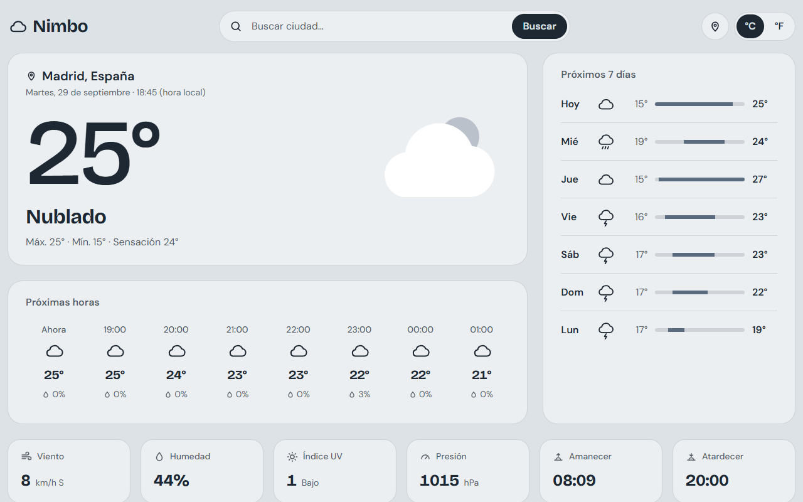
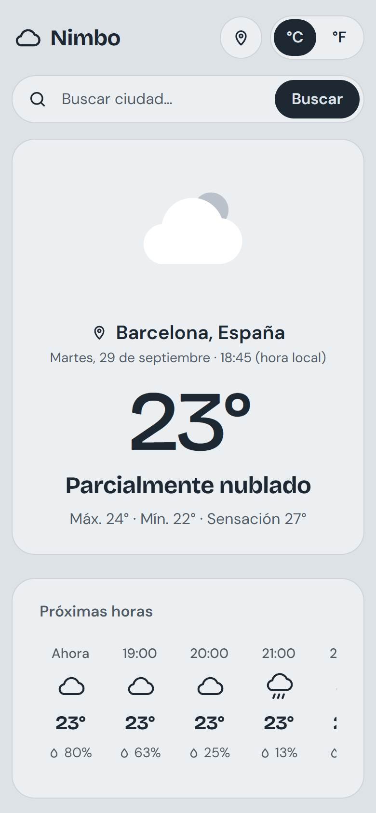
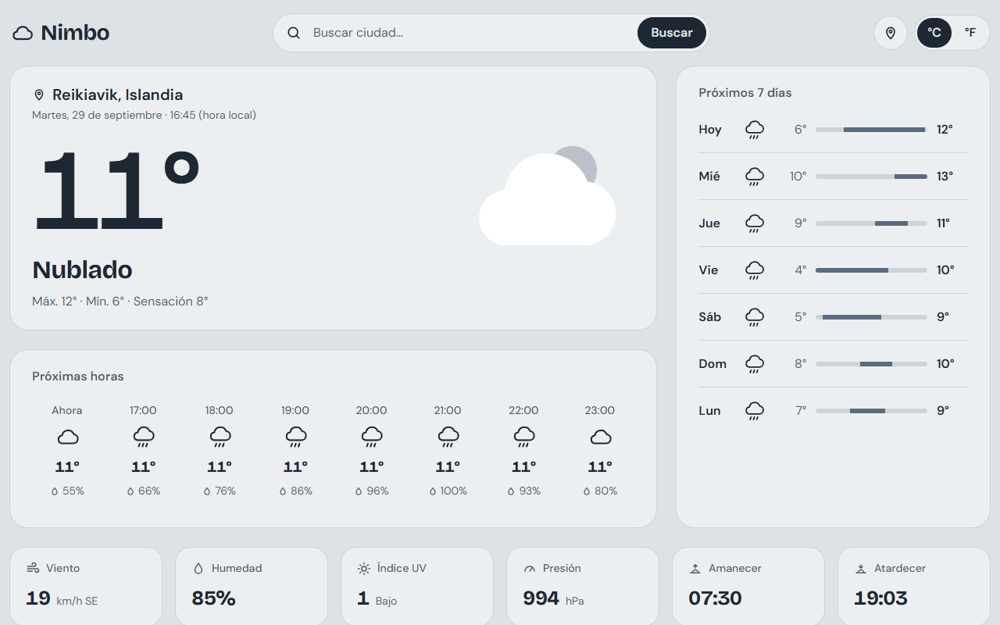

# Nimbo

Aplicación del tiempo hecha con SvelteKit y Bootstrap. Muestra el tiempo actual, las próximas horas y los próximos 7 días de cualquier lugar, y los colores de la página cambian según el tiempo que hace: soleado, nublado, lluvia, noche o nieve.

**Demo:** https://nimbo-mflores.vercel.app

## Capturas

<p align="center">
  
  
</p>
<p align="center">
  
</p>

## Qué hace

- Busca cualquier ciudad por su nombre. Si hay varias con el mismo nombre, las ofrece como alternativas.
- Usa la ubicación del navegador si le das permiso.
- Muestra la temperatura, la sensación térmica, el viento, la humedad, el índice UV, la presión y la hora de amanecer y atardecer.
- Previsión por horas con la probabilidad de lluvia, y previsión de 7 días con el rango de temperaturas de cada día.
- Cambia entre °C y °F y recuerda la elección.
- Cada lugar tiene su propia dirección (`/?lat=…&lon=…`), así que se puede guardar o compartir.
- Funciona también sin JavaScript: la página llega renderizada desde el servidor y el buscador es un formulario normal.

## Tecnología

- **SvelteKit 2** con **Svelte 5** (runas) y **TypeScript**.
- **Bootstrap 5.3** para la rejilla y los componentes (navbar, cards, list-group, progress, btn-group). Los colores de cada tiempo se definen como variables CSS que sustituyen a las de Bootstrap.
- **[Open-Meteo](https://open-meteo.com/)** para la previsión y el buscador de lugares. Es gratuito y no necesita clave de API.
- Fuentes Bricolage Grotesque y DM Sans alojadas en la propia web (Fontsource), sin llamadas a Google Fonts.
- Despliegue en **Vercel**, con las funciones en París y la página guardada 10 minutos en la CDN (Open-Meteo actualiza cada 15).
- Pruebas con **Vitest** para la conversión de datos de Open-Meteo.

## Estructura

```
src/
  lib/
    meteo.ts            API de Open-Meteo y conversión de sus datos (códigos WMO, fechas, unidades)
    meteo.test.ts       pruebas de meteo.ts
    unidad.svelte.ts    unidad °C/°F compartida y guardada en el navegador
    components/         Cabecera, Actual, Horas, Semana, Datos, iconos e ilustración
  routes/
    +page.ts            decide el lugar a partir de la URL y carga la previsión
    +page.svelte        página principal
  app.css               temas de color por tiempo sobre las variables de Bootstrap
```

## Uso en local

Requiere Node.js 22 o superior.

```sh
npm install
npm run dev       # servidor de desarrollo en http://localhost:5173
npm test          # pruebas (15 pruebas de la conversión de datos de Open-Meteo)
npm run check     # comprobación de tipos
```

## Créditos

- Datos meteorológicos: [Open-Meteo.com](https://open-meteo.com/), licencia [CC BY 4.0](https://creativecommons.org/licenses/by/4.0/).

## Autor

Mario Flores Rodríguez · [Portfolio](https://mfloresr-portfolio.vercel.app) · [GitHub](https://github.com/MFloresr)

## Licencia

[MIT](LICENSE) © 2026 Mario Flores Rodríguez. Los datos meteorológicos tienen su propia licencia (CC BY 4.0, Open-Meteo).
